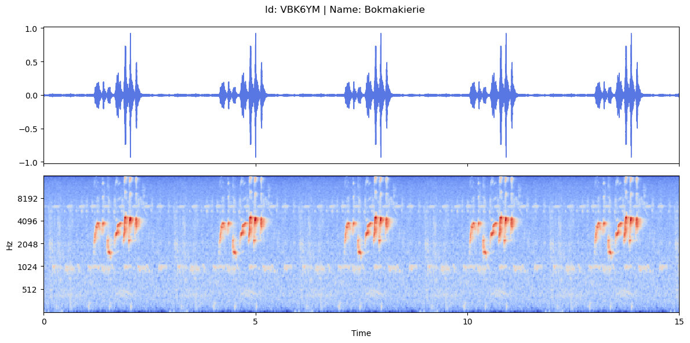

<h1 align="center" id="title">Bird-Call-Audio-Identification-using-Vision-Transfomer</h1>

Southern Africa is home to nearly 960 bird species many of which are unique to the region. Monitoring bird populations is essential for conservation and assessing ecosystem health but traditional methods rely heavily on human observation.

  

<h2>Objective:</h2>
The objective of this competition was to develop a machine learning model that can accurately identify 40 commonly heard bird species based on their calls. Using a dataset of 1857 audio recordings from xeno-canto participants will train a classification model capable of predicting which bird is calling in a given audio clip. A successful model could enable automated bird identification from remote microphone recordings reducing human effort and improving long-term bird population monitoring across Southern Africa.

<h2>Project Screenshots:</h2>

