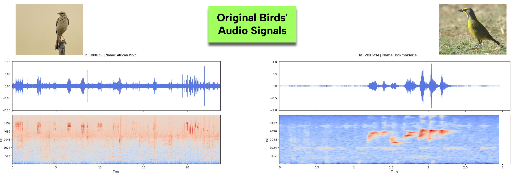
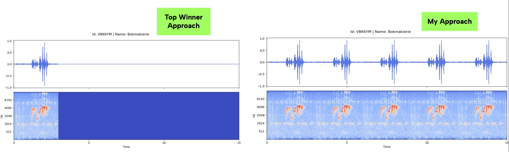
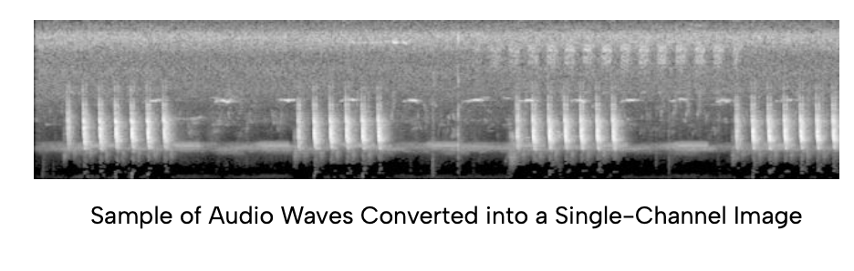
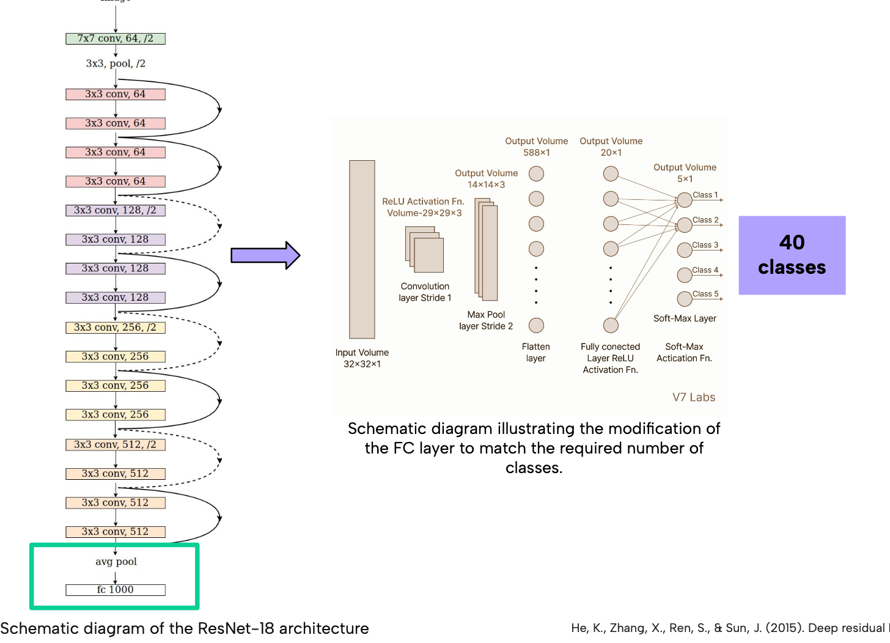
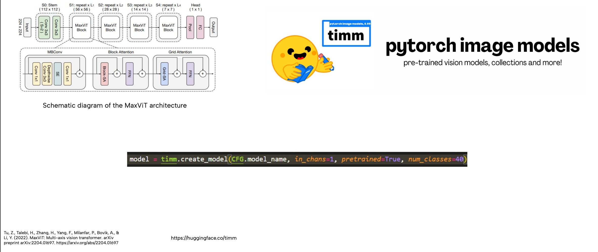

<h1 align="center" id="title">Bird-Call-Audio-Identification-using-Vision-Transfomer</h1>

<p id="description">Southern Africa is home to nearly 960 bird species many of which are unique to the region. Monitoring bird populations is essential for conservation and assessing ecosystem health but traditional methods rely heavily on human observation. 

<h2>Objective:</h2>

Improving upon one of the top winners' approaches to tackle the competition, the objective is to develop a machine learning model capable of accurately identifying 40 commonly heard bird species based on their calls. Using a dataset of 1,857 audio recordings from xeno-canto, participants will train a classification model to predict which bird is calling in a given audio clip. A successful model could enable automated bird identification from remote microphone recordings, reducing human effort and improving long-term bird population monitoring across Southern Africa</p>
 

<h2>Project Details:</h2>
<h3>Data Exploration</h3>
The bird audio data was visualized to analyze the patterns, characteristics, and frequency of the calls. During this process, it became apparent that the audio files varied in length, which could present challenges when processing and modeling the data.

<p1> </p1>




<h3>Dealing with Data Challenges</h3>

1. A specific duration for audio data was chosen.
The audio data that was shorter than the duration had to be dealt with. One of the top winners' approaches was to pad these short audios with zeros. To handle the varying duration(length) of audio data, I repeated the original audio by concatenating it with itself until it reached the desired duration. This method preserved the original content and ensured that all audio files were consistent in length, which is crucial for model training and processing.

This code demonstrates how to the audio data duration challenge is handled:


```python
if audio.shape[0] >= audio_length: # audio longer or same length with audio_length
        return audio[:audio_length]

    repeats = -(-audio_length // audio.shape[0]) # audio shorter than auido_length
    audio = np.tile(audio, repeats)[:audio_length]
```

<p1> </p1>

<h3>Result:</h3>



The audio data were then converted to <b>png images </b>.


```python
image = Image.fromarray(np_image)
        filename = os.path.join(os.getcwd(), 'train_images', 'spec_' + id + '.png')
        cv2.imwrite(filename, np.array(image))
```

<h3>Result:</h3>




<br>


2. There were approximately 40 different bird species to be predicted. One of the top winner's approaches involved using a ResNet model, with modifications made to the model’s head. This was necessary because the original ResNet model was trained to predict 1000 classes, not the 40 species in this case.



My approach was to use the <b>Timm's Pytorch Library</b> without the need to make modifications to the head of the model. 




<h3>Performance Comparison</h3>

<h4> </h4>
One of the Top winner score


<h4> </h4>
My score (using the above approach)


